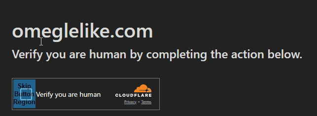
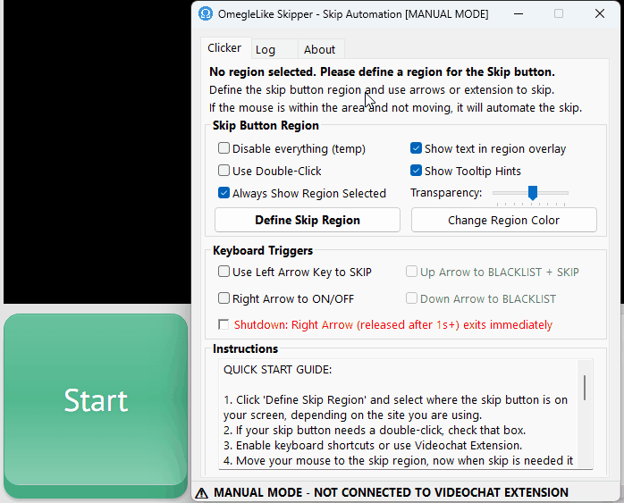

# OmegleLike Skipper

  

OmegleLike Skipper is a tool for skipping unwanted strangers on Omegle-like sites.

Here's what you can do with it:
- Use it solo to skip with the left arrow key instead of mouse clicks
- Hook it up with Videochat Extension to let it make the skip calls for you

Works like a charm anywhere you can skip with your mouse!

# Installation

Grab the latest version [here](https://github.com/videochat-extension/skipper/releases).  

# Why We Built This

We all know the struggle of dealing with unwanted users on Omegle clones. Back in the day, Videochat Extension had some sweet features to handle this:
- Arrow key skips
- AI gender filtering
- Location filtering
- Blacklisting

But after getting burned thrice with the site-specific approach, we decided to focus on building a universal WebRTC monitoring tool instead.

A lot of people kept asking for the automation to come back, so here we are!

Once we hit enough requests and wrapped up the core features of our new extension, we dove into building OmegleLike Skipper. 

We quickly realized that making a reliable clicker for every Omegle clone wouldn't work in a browser. We needed a standalone solution that could tap into the Windows API to make clicks look natural and safely configure where to click. Additionally, it was impossible to keep track of hundreds of sites' button IDs, and we needed global arrow hotkeys, which aren't possible in a Chromium-based browser.

We had big dreams for this thing - fancy macro sequences, presets, and super-realistic mouse movements. But after months of development headaches, we realized we were overcomplicating things. Sometimes the simplest solution is the best one - just clicking that skip button!

The biggest challenge? Making mouse movements look human turned out to be way harder than it would be to build our own omegle-like browser solving the same automation issue. The math behind natural-looking behavior is a real pain to implement.

Even though we put our nerves into making these algorithms look natural, they couldn't beat basic anti-bot systems. And any new algorithm would be a target for a model trained on its data. While these security issues are mostly theoretical, we've had some weird issues with ome.tv in the past that never got resolved. With machine learning being everywhere these days, have to be ready for anything.

**Important Notice**: While we've implemented all possible safety measures, using Skipper on sites with strict anti-bot policies carries inherent risks. Since nobody knows exactly how matching algorithms work on these platforms, frequent skipping might have unintended consequences - you could get matched with more unwanted users or experience longer wait times. Moderators may detect arrow key usage by looking at you through your camera. While we designed Skipper to work universally across Omegle-like platforms, we cannot guarantee compatibility with all sites or protect against any random third-party enforcement actions. Use at your own discretion.

We got so wrapped up in the math that we kinda lost sight of the goal - just clicking a button! Lesson learned - we'll be smarter about picking our battles from now on.

In the end, we ended up with a simple clicker...

# Setup

# License

This isn't open source, but we're keeping the code visible for transparency.  
For more details, check out the [releases page](https://github.com/videochat-extension/skipper/releases).
Check out the full license in the installer - the build workflow has the latest version.
